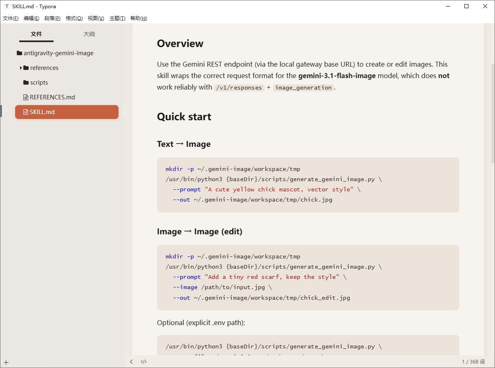

# Claude Theme for Typora

[English](#english) | 中文

---

一款灵感源自 [Claude.ai](https://claude.ai) 的 Typora 主题，以温暖的米白色为底，辅以珊瑚橙色点缀，带来优雅舒适的写作体验。

📸 预览截图


## ✨ 特性

- 🎨 **温暖配色** — 柔和的米白底色 `#f7f3ee`，搭配 Claude 标志性的珊瑚橙 `rgb(198, 97, 63)` 作为强调色
- 📐 **圆角卡片式排版** — 正文区域自带圆角和阴影，呈现精致的卡片效果
- 🧭 **侧边栏美化** — 文件列表与大纲项圆角高亮，选中态使用品牌色填充
- 📝 **丰富的 Markdown 元素样式** — 标题、引用、代码块、表格、任务列表等均经过精心设计
- 🖱️ **舒适交互** — 链接悬浮态、选中高亮、滚动条等细节均有打磨
- 🔤 **优质字体栈** — 默认使用 Inter / SF Pro Text / PingFang SC / Microsoft YaHei，西文中文兼顾

## 📦 安装

1. 下载 `claude.css` 文件
2. 打开 Typora → **偏好设置** → **外观** → **打开主题文件夹**
3. 将 `claude.css` 复制到主题文件夹
4. 重启 Typora，在 **主题** 菜单中选择 **Claude**

## 🎨 配色方案

| 用途           | 色值               | 预览 |
| -------------- | ------------------ | ---- |
| 主色（珊瑚橙） | `rgb(198, 97, 63)` | 🟠   |
| 页面背景       | `#f7f3ee`          | ⬜   |
| 编辑区背景     | `#f1ede6`          | ⬜   |
| 正文色         | `#2c2621`          | ⬛   |
| 标题色         | `#1a1714`          | ⬛   |
| 代码块背景     | `#ebe4db`          | ⬜   |
| 侧边栏背景     | `#ebe8e3`          | ⬜   |

## 🛠️ 自定义

如需微调配色，只需修改 `claude.css` 顶部 `:root` 中的 CSS 变量即可：

```css
:root {
  --claude-primary: rgb(198, 97, 63); /* 主色调 */
  --bg-color: #f1ede6; /* 编辑区背景 */
  --page-bg: #f7f3ee; /* 页面背景 */
  --text-color: #2c2621; /* 正文颜色 */
  --heading-color: #1a1714; /* 标题颜色 */
  /* ... */
}
```

## 📄 许可

MIT License — 自由使用与修改。

---

<a name="english"></a>

# Claude Theme for Typora

[中文](#) | English

---

A Typora theme inspired by [Claude.ai](https://claude.ai) — featuring a warm off-white background with coral-orange accents for an elegant and comfortable writing experience.

<!-- 📸 Preview Screenshot -->
<!--  -->

## ✨ Features

- 🎨 **Warm Color Palette** — Soft off-white base `#f7f3ee` paired with Claude's signature coral-orange `rgb(198, 97, 63)` as the accent color
- 📐 **Card-style Layout** — Content area with rounded corners and subtle shadow for a refined card look
- 🧭 **Polished Sidebar** — File list and outline items with rounded highlights; active state filled with brand color
- 📝 **Rich Markdown Styling** — Headings, blockquotes, code blocks, tables, task lists, and more — all carefully crafted
- 🖱️ **Comfortable Interactions** — Refined link hover states, selection highlights, and scrollbar styling
- 🔤 **Premium Font Stack** — Defaults to Inter / SF Pro Text / PingFang SC / Microsoft YaHei for both Latin and CJK text

## 📦 Installation

1. Download the `claude.css` file
2. Open Typora → **Preferences** → **Appearance** → **Open Theme Folder**
3. Copy `claude.css` into the theme folder
4. Restart Typora and select **Claude** from the **Themes** menu

## 🎨 Color Scheme

| Purpose            | Value              | Preview |
| ------------------ | ------------------ | ------- |
| Primary (Coral)    | `rgb(198, 97, 63)` | 🟠      |
| Page Background    | `#f7f3ee`          | ⬜      |
| Editor Background  | `#f1ede6`          | ⬜      |
| Body Text          | `#2c2621`          | ⬛      |
| Heading Text       | `#1a1714`          | ⬛      |
| Code Background    | `#ebe4db`          | ⬜      |
| Sidebar Background | `#ebe8e3`          | ⬜      |

## 🛠️ Customization

To tweak the colors, simply edit the CSS variables in the `:root` block at the top of `claude.css`:

```css
:root {
  --claude-primary: rgb(198, 97, 63); /* Primary accent */
  --bg-color: #f1ede6; /* Editor background */
  --page-bg: #f7f3ee; /* Page background */
  --text-color: #2c2621; /* Body text */
  --heading-color: #1a1714; /* Heading text */
  /* ... */
}
```

## 📄 License

MIT License — free to use and modify.
